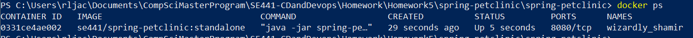
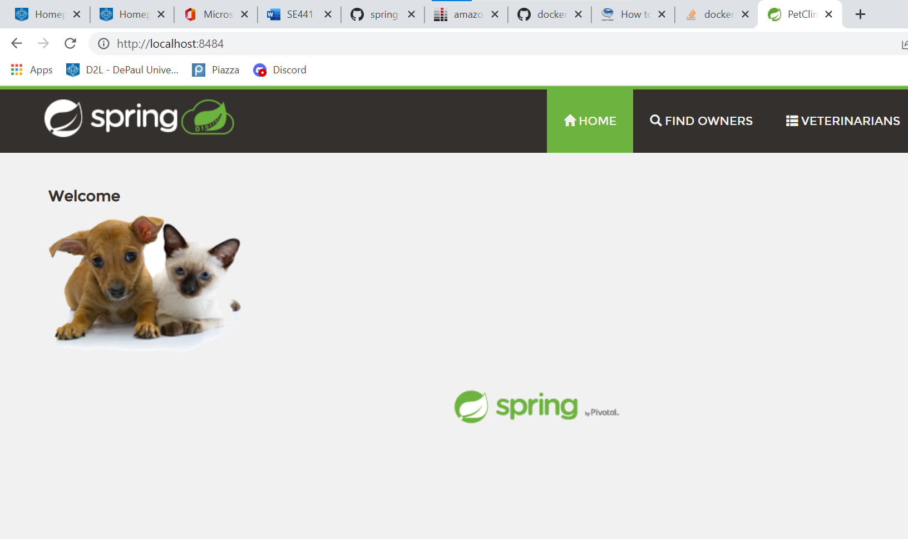
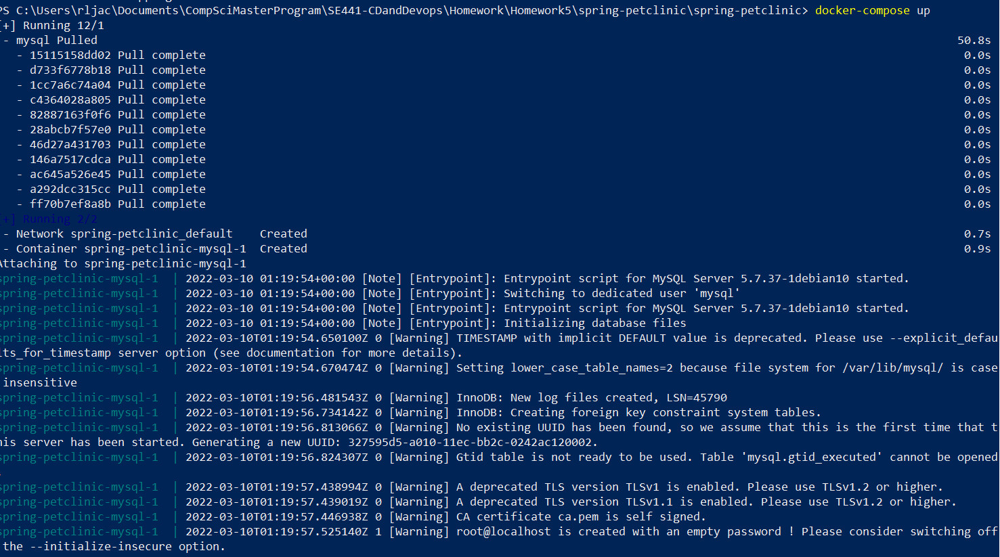
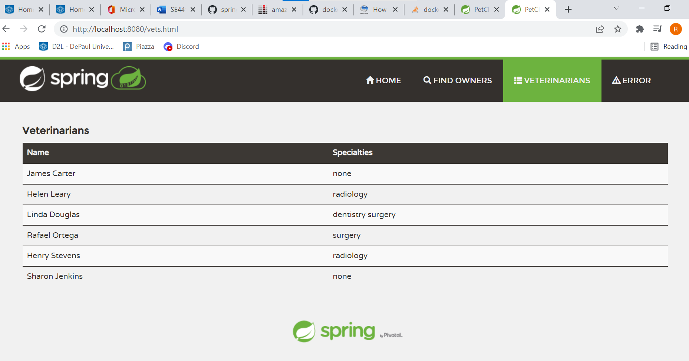
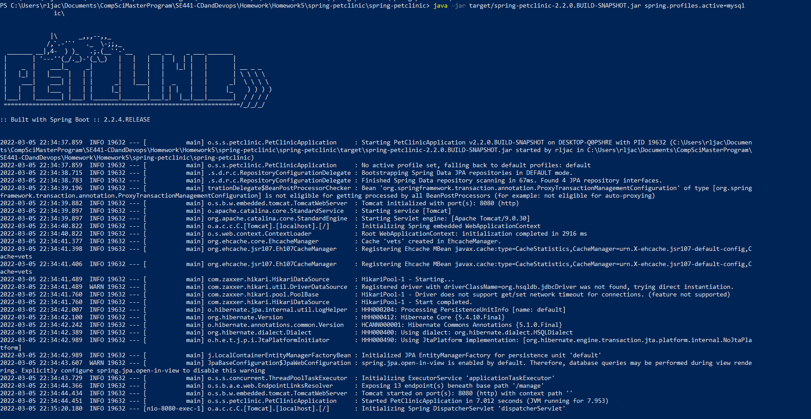
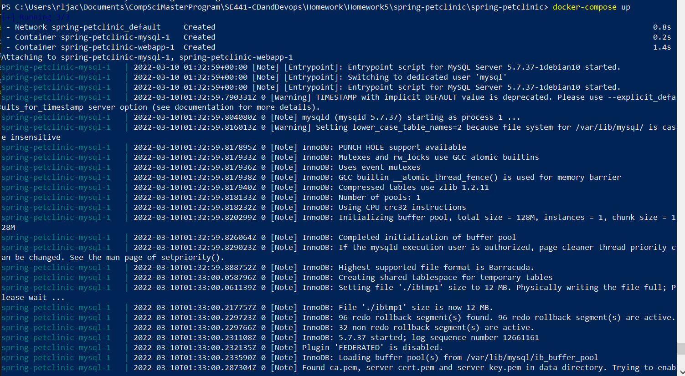
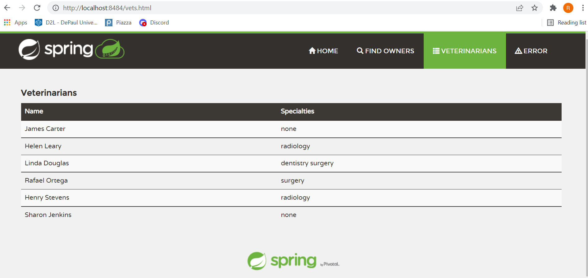

Rachel Jacobsohn (1968440)
SE441 – CD and Devops 
Homework 8 

 Screen captures have been added to the "figures/HW8" directory.

DOCKER  

Your dockerfile. Please provide a link to this file rather than a screen capture.  
https://github.com/racheljacobsohn/spring-petclinic/blob/master/DockerFile.txt 

FROM openjdk:8u282-jre 
MAINTAINER Rachel Jacobsohn <rjacob24@depaul.edu> 
EXPOSE 8080 
COPY target/spring-petclinic-2.2.0.BUILD-SNAPSHOT.jar / 
ENTRYPOINT ["java","-jar","spring-petclinic-2.2.0.BUILD-SNAPSHOT.jar"] 

Your running docker instance as shown by a ps command.  

Your browser accessing the main page of the website from your local container. 
 

 
DOCKER COMPOSE - MYSQL ONLY  

The output from the docker-compose up command.  
  

Your browser accessing the “Veterinarians” page of the website from your local container when you run the application from the host system.  
 

A section of the stack trace generated when you attempt to run the application container that has been updated to use MySQL 
 

 
DOCKER COMPOSE - APP SERVER AND MYSQL  

Your updated docker-compose.yml file containing the application server, built from your local Dockerfile, and the existing MySQL configuration. Please provide a link to this file rather than a screen capture.  
https://github.com/racheljacobsohn/spring-petclinic/blob/master/docker-compose.yml 

Your updated application-mysql.properties file containing the URL change for the database server. Please provide a link to this file rather than a screen capture.  
https://github.com/racheljacobsohn/spring-petclinic/blob/master/src/main/resources/application-mysql.properties  

The output from the docker-compose up command.  
  

Your browser accessing the “Veterinarians” page of the website from your local container. 
 
 